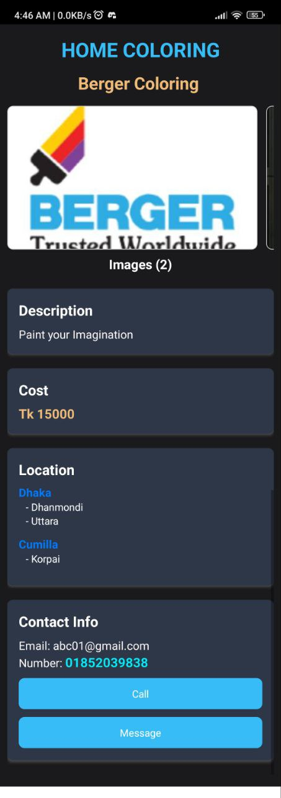

# LivingConnect 🏡

## **University of Dhaka 🌐**  
**Department of Computer Science & Engineering 💻**  
**CSE 2216 - Application Development Lab (Batch 28) 📚**

---

### **Project Overview 🔍**
LivingConnect is a mobile application designed to simplify the process of finding and renting homes. The app integrates personalized filters, real-time map views, and an intuitive interface for seamless interaction between renters and property owners. Additionally, the platform offers services such as community centers for program purposes and essential home-related services like house shifting, coloring, and repairs.

---

### **Team Details  ✨🧠**
**Team Name:** DU_CodeX_Legends

#### **Team Members 👥:**
- **Md. Ashraful Alam** (Roll: 02)
- **Md. Tauseef - Ur - Rahman** (Roll: 24)
- **Sumaiya Tabassum** (Roll: 29)
- **Tamzid Bin Tariq** (Roll: 48)

---

### **App Features 🌐**
- **Interactive Map 🗺:** View available properties directly on the map.
- **Location-based Property Search 🌍:** Filter properties by area.
- **Property Details 🔗:** View detailed information about homes.
- **Direct Messaging 📢:** Secure communication between renters and owners.
- **Custom Filters ⚙️:** Search properties based on user-defined preferences.
- **Secure Payment Gateway 🛒:** Simplified rental payment solutions.

---

### **Technologies Used 📚**
- **Frontend:** React Native (Expo Framework) ✨
- **Backend:** Node.js with MongoDB ⚡️
- **Maps:** react-native-maps for location-based features 🌏
- **API Integration:** Axios for data fetching 🔗
- **UI Styling:** Tailwind CSS 🖌️

---

### **Project Images 📸**

<div style="display: grid; grid-template-columns: repeat(4, 1fr); gap: 10px;">                                          </div>

---

### **Installation Instructions 🔧**
1. Clone the repository from GitHub.
   ```bash
   git clone https://github.com/TAUSEEF-01/LivingConnect.git
   cd LivingConnect
   ```
2. Install project dependencies:
   ```bash
   npm install
   ```
3. Start the Expo development server:
   ```bash
   cd Frontend
   npx expo start
   ```
4. To run the backend server:
   ```bash
   cd Backend
   nodemon app.js
   ```
5. Test the app on an emulator or a physical device using Expo Go.

---

### **Running the APK 💻**
To run the built APK on Android:
1. Build the APK using EAS Build or Android Studio.
2. Install the APK on your device.
3. Launch the app to explore its features.

---

### **Acknowledgments 🙏**
This project is submitted as part of the coursework for **CSE 2216 - Application Development Lab** at **University of Dhaka**.

🌟 If you find this project interesting or helpful, please consider giving it a star on GitHub! Your support motivates us to keep improving. 😊


